# Serverless RDS Provisioning System

[](https://aws.amazon.com/)
[](https://circleci.com/)
[](LICENSE)

A fully automated, event-driven pipeline to provision **MySQL** or **PostgreSQL** databases on AWS RDS — using **API Gateway**, **SNS**, **SQS**, **Lambda**, **GitHub**, and **Terraform**.  
This project was built as part of a Junior DevOps assignment.

---

## 🧱 Architecture Overview

```mermaid
graph TD
    A[Developer → POST JSON] --> B(API Gateway)
    B --> C(SNS Topic)
    C --> D(SQS Queue)
    D --> E(Lambda Function)
    E --> F[GitHub PR with Terraform code]
    F --> G[CircleCI on PR Merge]
    G --> H[SAM Deployment + Terraform Apply]
    H --> I[RDS Instance Provisioned]
```



---

## 🛠️ Tech Stack

- **API Gateway** – Receives incoming POST requests
- **SNS + SQS** – Event fan-out and queuing mechanism
- **Lambda** – Proceses events and triggers GitHub PRs
- **GitHub** – Stores Terraform code, triggers CircleCI
- **CircleCI** – CI/CD runner for SAM and Terraform
- **Terraform** – Provisions AWS RDS based on JSON input
- **AWS Secrets Manager** – Stores DB credentials securely
- **SAM (Serverless Application Model)** – Deploys infra

---

## 📥 Example JSON Payload

```json
{
  "db_name": "mydb",
  "engine": "postgres",
  "env": "prod"
}
```

## ⚙️ Setup Instructions

### 1. 🧑‍💻 Clone the Repository

```bash
git clone https://github.com/BENHAIM21K/Junior_DevOps
cd Junior_DevOps
```

### 2. 🔐 Disable AWS Access Keys (IMPORTANT)

Before pushing your code, ensure no active AWS credentials are exposed:

```bash
aws configure list
# Then go to AWS console and deactivate/delete any access keys used
```

### 3. 🛠️ SAM Deployment

```bash
cd sam_template/
sam build
sam deploy --guided
```

### 4. 🚀 CircleCI Setup

- Go to your GitHub repo → Connect it to [CircleCI](https://circleci.com/)
- Set environment variables:
  - `AWS_ACCESS_KEY_ID`
  - `AWS_SECRET_ACCESS_KEY`

Once connected, PR merges will automatically trigger deployment.

---

## 📌 Behavior Based on Environment

| Env Value | DB Instance Class       |
|-----------|--------------------------|
| `test`    | `db.t3.micro` (smallest) |
| `prod`    | `db.t3.small` (2nd smallest) |

---

